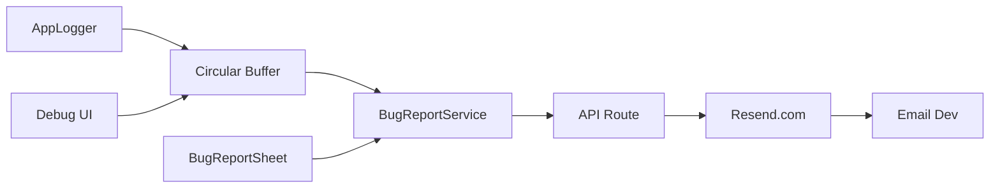

# Implementacja systemu logowania i bug reportera dla Flutter Desktop

> **Cel:** Szczegółowy prompt dla AI Agenta do wdrożenia profesjonalnego systemu logowania i
> raportowania błędów w aplikacji Flutter Desktop, wzorowany na APPteczka.

---

## Przegląd systemu

System składa się z 3 komponentów:

| Komponent            | Rola                                           | Lokalizacja                            |
| -------------------- | ---------------------------------------------- | -------------------------------------- |
| **AppLogger**        | Centralny system logowania z circular buffer   | `lib/services/app_logger.dart`         |
| **BugReportService** | Wysyłanie raportów do API                      | `lib/services/bug_report_service.dart` |
| **BugReportSheet**   | UI do zbierania feedbacku                      | `lib/widgets/bug_report_sheet.dart`    |
| **API Route**        | Backend przyjmujący raporty (Next.js + Resend) | `api/bug-report/route.ts`              |



---

## KROK 1: AppLogger (Centralny system logowania)

### Wymagania

- Singleton pattern
- Circular buffer (ostatnie N wpisów, np. 100)
- Integracja z pakietem `logging` z Dart SDK
- Poziomy: FINE, INFO, WARNING, SEVERE
- Formatowanie ISO 8601 timestamp
- Możliwość dodawania logów z natywnego kodu (opcjonalne dla desktop)

### Implementacja

Utwórz `lib/services/app_logger.dart`:

```dart
// app_logger.dart - Professional logging system with BugReportService integration

import 'package:logging/logging.dart';
import 'package:flutter/foundation.dart';

class AppLogger {
  static final AppLogger _instance = AppLogger._();
  static bool _initialized = false;

  static const int _maxLogEntries = 100;
  static final List<String> _logBuffer = [];

  AppLogger._();

  /// Inicjalizuj raz w main()
  static void init() {
    if (_initialized) return;

    Logger.root.level = kReleaseMode ? Level.WARNING : Level.ALL;

    Logger.root.onRecord.listen((record) {
      final formatted = _formatLogRecord(record);
      _addToBuffer(formatted);
      if (!kReleaseMode || record.level >= Level.WARNING) {
        // ignore: avoid_print
        print(formatted);
      }
    });

    _initialized = true;
    Logger('AppLogger').info('Logger initialized (${kReleaseMode ? "RELEASE" : "DEBUG"} mode)');
  }

  static Logger getLogger(String name) {
    if (!_initialized) init();
    return Logger(name);
  }

  static String _formatLogRecord(LogRecord record) {
    final timestamp = record.time.toIso8601String();
    final level = record.level.name.padRight(7);
    final source = record.loggerName;

    var message = '[$timestamp] $level [$source] ${record.message}';

    if (record.error != null) {
      message += '\n  Error: ${record.error}';
    }
    if (record.stackTrace != null) {
      final lines = record.stackTrace.toString().split('\n').take(5).join('\n');
      message += '\n  Stack:\n$lines';
    }
    return message;
  }

  static void _addToBuffer(String entry) {
    _logBuffer.add(entry);
    if (_logBuffer.length > _maxLogEntries) {
      _logBuffer.removeAt(0);
    }
  }

  static String getLogBuffer() => _logBuffer.join('\n');
  static void clearBuffer() => _logBuffer.clear();
  static int get bufferSize => _logBuffer.length;

  /// Pobiera strukturyzowane wpisy (do filtrowania)
  static List<LogEntry> getLogEntries() {
    return _logBuffer.map((line) => LogEntry.parse(line)).toList();
  }

  /// Unikalne źródła/kanały
  static Set<String> getUniqueSources() {
    return getLogEntries()
        .map((e) => e.source)
        .where((s) => s.isNotEmpty)
        .toSet();
  }
}

/// Pojedynczy wpis logu - do filtrowania
class LogEntry {
  final String level;
  final String source;
  final String message;
  final String rawLine;

  const LogEntry({
    required this.level,
    required this.source,
    required this.message,
    required this.rawLine,
  });

  factory LogEntry.parse(String line) {
    final regex = RegExp(r'\[([^\]]+)\]\s+(\w+)\s+\[([^\]]+)\]\s*(.*)');
    final match = regex.firstMatch(line);

    if (match != null) {
      return LogEntry(
        level: match.group(2)?.trim() ?? 'INFO',
        source: match.group(3) ?? '',
        message: match.group(4) ?? '',
        rawLine: line,
      );
    }
    return LogEntry(level: 'INFO', source: '', message: line, rawLine: line);
  }
}
```

### Użycie w kodzie

```dart
class MyService {
  static final _log = AppLogger.getLogger('MyService');

  void doSomething() {
    _log.info('Operacja rozpoczęta');
    _log.fine('Debug: $data');  // tylko w debug
    _log.warning('Brak danych');
    _log.severe('Błąd krytyczny', error, stackTrace);
  }
}
```

### Inicjalizacja w main()

```dart
void main() {
  AppLogger.init();
  runApp(const MyApp());
}
```

---

## KROK 2: BugReportService (Wysyłanie raportów)

### Wymagania

- Pobieranie logów z AppLogger
- Zbieranie metadanych (wersja, urządzenie, kanał)
- Wysyłanie do API jako JSON
- Obsługa załączników (screenshoty base64)
- Kategorie: Bug, Sugestia, Pytanie

### Zależności (pubspec.yaml)

```yaml
dependencies:
  http: ^1.2.0
  package_info_plus: ^8.0.0
  device_info_plus: ^10.0.0
```

### Implementacja

Utwórz `lib/services/bug_report_service.dart`:

```dart
import 'dart:convert';
import 'dart:io';
import 'dart:typed_data';
import 'package:http/http.dart' as http;
import 'package:logging/logging.dart';
import 'package:package_info_plus/package_info_plus.dart';
import 'package:device_info_plus/device_info_plus.dart';
import 'app_logger.dart';

enum ReportCategory {
  bug('Bug', 'Coś nie działa'),
  suggestion('Sugestia', 'Mam pomysł'),
  question('Pytanie', 'Potrzebuję pomocy');

  final String label;
  final String description;
  const ReportCategory(this.label, this.description);
}

class BugReportService {
  static final BugReportService instance = BugReportService._();
  static final Logger _log = AppLogger.getLogger('BugReportService');

  BugReportService._();

  // ZMIEŃ NA SWÓJ ENDPOINT
  static const String _apiUrl = 'https://twoja-domena.com/api/bug-report';

  String getLogs() => AppLogger.getLogBuffer();
  void clearLogs() => AppLogger.clearBuffer();

  Future<String> getDeviceInfo() async {
    try {
      final deviceInfo = DeviceInfoPlugin();
      if (Platform.isWindows) {
        final info = await deviceInfo.windowsInfo;
        return 'Windows ${info.majorVersion}.${info.minorVersion} (${info.computerName})';
      } else if (Platform.isMacOS) {
        final info = await deviceInfo.macOsInfo;
        return '${info.model} (macOS ${info.osRelease})';
      } else if (Platform.isLinux) {
        final info = await deviceInfo.linuxInfo;
        return 'Linux ${info.prettyName}';
      }
      return 'Unknown desktop';
    } catch (e) {
      return 'Device info unavailable';
    }
  }

  Future<String> getAppVersion() async {
    try {
      final info = await PackageInfo.fromPlatform();
      return '${info.version}+${info.buildNumber}';
    } catch (e) {
      return 'Unknown';
    }
  }

  Future<BugReportResult> sendReport({
    String? text,
    String? topic,
    String? errorMessage,
    ReportCategory category = ReportCategory.bug,
    String? replyEmail,
    bool includeLogs = true,
    List<Uint8List>? screenshots,
  }) async {
    try {
      _log.info('Sending report (category=${category.name}, photos=${screenshots?.length ?? 0})');

      final appVersion = await getAppVersion();
      final deviceInfo = await getDeviceInfo();

      final body = <String, dynamic>{
        'appVersion': appVersion,
        'deviceInfo': deviceInfo,
        'category': category.name,
        'channel': const String.fromEnvironment('CHANNEL', defaultValue: 'production'),
      };

      if (replyEmail?.isNotEmpty == true) body['replyEmail'] = replyEmail;
      if (text?.isNotEmpty == true) body['text'] = text;
      if (topic?.isNotEmpty == true) body['topic'] = topic;
      if (errorMessage?.isNotEmpty == true) body['errorMessage'] = errorMessage;

      if (includeLogs) {
        final logs = AppLogger.getLogBuffer();
        if (logs.isNotEmpty) {
          body['log'] = logs;
        }
      }

      if (screenshots?.isNotEmpty == true) {
        body['screenshots'] = screenshots!.map((s) => base64Encode(s)).toList();
      }

      final response = await http.post(
        Uri.parse(_apiUrl),
        headers: {'Content-Type': 'application/json'},
        body: jsonEncode(body),
      );

      if (response.statusCode == 200) {
        _log.info('Report sent successfully');
        return BugReportResult.success();
      } else {
        String errorMsg = 'Błąd serwera (${response.statusCode})';
        if (response.body.isNotEmpty) {
          try {
            final data = jsonDecode(response.body);
            errorMsg = data['error'] ?? errorMsg;
          } catch (_) {}
        }
        _log.warning('Report failed: $errorMsg');
        return BugReportResult.failure(errorMsg);
      }
    } on SocketException catch (e) {
      _log.severe('Network error', e);
      return BugReportResult.failure('Brak połączenia z internetem');
    } catch (e, stackTrace) {
      _log.severe('Unexpected error', e, stackTrace);
      return BugReportResult.failure('Błąd wysyłania: $e');
    }
  }
}

class BugReportResult {
  final bool success;
  final String? error;

  BugReportResult._({required this.success, this.error});

  factory BugReportResult.success() => BugReportResult._(success: true);
  factory BugReportResult.failure(String error) =>
      BugReportResult._(success: false, error: error);
}
```

---

## KROK 3: BugReportSheet (UI)

### Wymagania

- BottomSheet z formularzem
- Wybór kategorii (Bug/Sugestia/Pytanie)
- Pole tekstowe na opis
- Załączanie zdjęć z galerii
- Checkbox "Dołącz logi"
- Przycisk wysyłania ze stanem ładowania

### Zależności

```yaml
dependencies:
  image_picker: ^1.0.0 # lub file_picker dla desktop
```

> **Uwaga:** `image_picker` wymaga dodatkowej konfiguracji dla desktop. Alternatywnie użyj
> `file_picker`.

### Implementacja (uproszczona)

Utwórz `lib/widgets/bug_report_sheet.dart` - dostosuj do swojego systemu projektowego:

```dart
import 'dart:typed_data';
import 'package:flutter/material.dart';
import '../services/bug_report_service.dart';

class BugReportSheet extends StatefulWidget {
  const BugReportSheet({super.key});

  static Future<void> show(BuildContext context) {
    return showModalBottomSheet(
      context: context,
      isScrollControlled: true,
      builder: (context) => const BugReportSheet(),
    );
  }

  @override
  State<BugReportSheet> createState() => _BugReportSheetState();
}

class _BugReportSheetState extends State<BugReportSheet> {
  final _textController = TextEditingController();
  final _topicController = TextEditingController();
  ReportCategory _category = ReportCategory.bug;
  bool _includeLogs = true;
  bool _isSending = false;
  final List<Uint8List> _photos = [];

  @override
  void dispose() {
    _textController.dispose();
    _topicController.dispose();
    super.dispose();
  }

  Future<void> _send() async {
    if (_textController.text.trim().isEmpty && _topicController.text.trim().isEmpty) {
      ScaffoldMessenger.of(context).showSnackBar(
        const SnackBar(content: Text('Dodaj opis lub temat')),
      );
      return;
    }

    setState(() => _isSending = true);

    final result = await BugReportService.instance.sendReport(
      text: _textController.text.trim(),
      topic: _topicController.text.trim(),
      category: _category,
      includeLogs: _includeLogs,
      screenshots: _photos.isNotEmpty ? _photos : null,
    );

    if (!mounted) return;
    setState(() => _isSending = false);
    Navigator.pop(context);

    ScaffoldMessenger.of(context).showSnackBar(
      SnackBar(
        content: Text(result.success ? 'Wysłano!' : 'Błąd: ${result.error}'),
        backgroundColor: result.success ? Colors.green : Colors.red,
      ),
    );
  }

  @override
  Widget build(BuildContext context) {
    return SafeArea(
      child: Padding(
        padding: EdgeInsets.only(
          left: 16, right: 16, top: 16,
          bottom: MediaQuery.of(context).viewInsets.bottom + 16,
        ),
        child: Column(
          mainAxisSize: MainAxisSize.min,
          crossAxisAlignment: CrossAxisAlignment.stretch,
          children: [
            Text('Zgłoś problem', style: Theme.of(context).textTheme.titleLarge),
            const SizedBox(height: 16),

            // Kategoria
            SegmentedButton<ReportCategory>(
              segments: ReportCategory.values.map((c) =>
                ButtonSegment(value: c, label: Text(c.label)),
              ).toList(),
              selected: {_category},
              onSelectionChanged: (s) => setState(() => _category = s.first),
            ),
            const SizedBox(height: 16),

            // Temat
            TextField(
              controller: _topicController,
              decoration: const InputDecoration(
                labelText: 'Temat',
                border: OutlineInputBorder(),
              ),
            ),
            const SizedBox(height: 12),

            // Opis
            TextField(
              controller: _textController,
              maxLines: 3,
              decoration: const InputDecoration(
                labelText: 'Opis (opcjonalnie)',
                border: OutlineInputBorder(),
              ),
            ),
            const SizedBox(height: 12),

            // Logi
            CheckboxListTile(
              title: const Text('Dołącz logi aplikacji'),
              subtitle: const Text('Informacje techniczne'),
              value: _includeLogs,
              onChanged: (v) => setState(() => _includeLogs = v ?? true),
            ),
            const SizedBox(height: 16),

            // Wyślij
            FilledButton.icon(
              onPressed: _isSending ? null : _send,
              icon: _isSending
                ? const SizedBox(width: 20, height: 20, child: CircularProgressIndicator(strokeWidth: 2))
                : const Icon(Icons.send),
              label: Text(_isSending ? 'Wysyłanie...' : 'Wyślij raport'),
            ),
          ],
        ),
      ),
    );
  }
}
```

---

## KROK 4: Debug UI (Ustawienia → Zaawansowane → Debug)

### Wymagania

- Widoczne tylko w buildach `internal`
- Podgląd logów w BottomSheet
- Filtrowanie po poziomach (INFO/WARNING/SEVERE)
- Filtrowanie po źródłach/kanałach
- Przyciski: Wyczyść filtry, Wyczyść logi, Kopiuj jako tekst

### AppConfig (kanały budowania)

```dart
class AppConfig {
  static const String channel = String.fromEnvironment(
    'CHANNEL',
    defaultValue: 'production',
  );
  static bool get isInternal => channel == 'internal';
}
```

### Komendy budowania

```bash
# Internal (z debug UI)
flutter build windows --dart-define=CHANNEL=internal

# Production (bez debug UI)
flutter build windows --dart-define=CHANNEL=production
```

### Przykład sekcji w ustawieniach

```dart
if (AppConfig.isInternal) ...[
  ListTile(
    leading: const Icon(Icons.bug_report),
    title: const Text('Debug'),
    subtitle: Text('${AppLogger.bufferSize} wpisów'),
    onTap: () => _showDebugLogSheet(context),
  ),
],
```

---

## KROK 5: API Route (Next.js + Resend)

### Wymagania Resend

1. Zarejestruj się na [resend.com](https://resend.com)
2. Zweryfikuj domenę (DNS records)
3. Utwórz API key

### Zmienne środowiskowe (.env.local)

```env
RESEND_API_KEY=re_xxxxxxxxxxxxxxxxxxxx
RESEND_FROM=App Name <noreply@twoja-domena.com>
BUG_REPORT_EMAIL=developer@twoja-domena.com
```

### Implementacja API Route

Utwórz `src/app/api/bug-report/route.ts`:

```typescript
import { NextRequest, NextResponse } from "next/server";

const BUG_REPORT_EMAIL = process.env.BUG_REPORT_EMAIL || "dev@example.com";
const RESEND_API_KEY = process.env.RESEND_API_KEY;
const RESEND_FROM = process.env.RESEND_FROM || "App <noreply@example.com>";

interface BugReportRequest {
	log?: string;
	text?: string;
	topic?: string;
	screenshots?: string[]; // base64
	appVersion?: string;
	deviceInfo?: string;
	errorMessage?: string;
	category?: string;
	channel?: string;
	replyEmail?: string;
}

export async function POST(request: NextRequest) {
	try {
		if (!RESEND_API_KEY) {
			return NextResponse.json({ error: "Config error" }, { status: 500 });
		}

		const body: BugReportRequest = await request.json();
		const {
			log,
			text,
			topic,
			screenshots,
			appVersion,
			deviceInfo,
			errorMessage,
			category,
			channel,
			replyEmail,
		} = body;

		if (!log && !text && !topic) {
			return NextResponse.json({ error: "Brak danych" }, { status: 400 });
		}

		const timestamp = new Date().toISOString();
		const subject = `[App] ${getCategoryLabel(category)}: ${topic || "Raport"}`;

		const htmlContent = `
<!DOCTYPE html>
<html>
<head>
    <style>
        body { font-family: system-ui; padding: 20px; color: #333; }
        .header { background: #1a1a2e; color: #4ade80; padding: 20px; border-radius: 8px; }
        .section { margin: 20px 0; padding: 15px; background: #f5f5f5; border-radius: 8px; }
        pre { background: #1a1a2e; color: #e2e8f0; padding: 15px; border-radius: 8px; overflow-x: auto; }
    </style>
</head>
<body>
    <div class="header">
        <h1>${escapeHtml(subject)}</h1>
        <p>Otrzymano: ${timestamp}</p>
    </div>
    
    ${topic ? `<div class="section"><strong>Temat:</strong> ${escapeHtml(topic)}</div>` : ""}
    ${text ? `<div class="section"><strong>Opis:</strong><br>${escapeHtml(text)}</div>` : ""}
    ${errorMessage ? `<div class="section" style="color:red"><strong>Błąd:</strong> ${escapeHtml(errorMessage)}</div>` : ""}
    
    <div class="section">
        <strong>System:</strong><br>
        Wersja: ${appVersion || "?"}<br>
        Urządzenie: ${deviceInfo || "?"}<br>
        Kanał: ${channel || "production"}<br>
        ${replyEmail ? `Odpowiedz do: ${escapeHtml(replyEmail)}` : ""}
    </div>
    
    ${log ? `<div class="section"><strong>Logi:</strong><pre>${escapeHtml(log)}</pre></div>` : ""}
</body>
</html>`;

		const attachments: { filename: string; content: string }[] = [];

		if (log) {
			attachments.push({
				filename: `log_${timestamp.replace(/[:.]/g, "-")}.txt`,
				content: Buffer.from(log).toString("base64"),
			});
		}

		if (screenshots?.length) {
			screenshots.forEach((s, i) => {
				attachments.push({
					filename: `screenshot_${i + 1}.png`,
					content: s,
				});
			});
		}

		const response = await fetch("https://api.resend.com/emails", {
			method: "POST",
			headers: {
				Authorization: `Bearer ${RESEND_API_KEY}`,
				"Content-Type": "application/json",
			},
			body: JSON.stringify({
				from: RESEND_FROM,
				to: [BUG_REPORT_EMAIL],
				subject,
				html: htmlContent,
				attachments: attachments.length ? attachments : undefined,
			}),
		});

		if (!response.ok) {
			const err = await response.json().catch(() => ({}));
			console.error("Resend error:", err);
			return NextResponse.json({ error: "Send failed" }, { status: 500 });
		}

		return NextResponse.json({ success: true });
	} catch (error) {
		console.error("API error:", error);
		return NextResponse.json({ error: "Server error" }, { status: 500 });
	}
}

function escapeHtml(text: string): string {
	return text
		.replace(/&/g, "&amp;")
		.replace(/</g, "&lt;")
		.replace(/>/g, "&gt;")
		.replace(/"/g, "&quot;")
		.replace(/\n/g, "<br>");
}

function getCategoryLabel(category?: string): string {
	switch (category) {
		case "bug":
			return "Bug";
		case "suggestion":
			return "Sugestia";
		case "question":
			return "Pytanie";
		default:
			return "Raport";
	}
}
```

---

## KROK 6: Dokumentacja

Utwórz `docs/logging.md` i `docs/standards/debug.md` z opisem systemu.

---

## Checklist implementacji

```markdown
- [ ] `lib/services/app_logger.dart` - centralny logger
- [ ] `lib/services/bug_report_service.dart` - wysyłanie raportów
- [ ] `lib/widgets/bug_report_sheet.dart` - UI formularz
- [ ] `lib/config/app_config.dart` - kanały budowania
- [ ] Inicjalizacja `AppLogger.init()` w `main()`
- [ ] Debug UI w ustawieniach (tylko `isInternal`)
- [ ] API Route `api/bug-report/route.ts`
- [ ] Zmienne `.env.local` (RESEND_API_KEY, etc.)
- [ ] Dokumentacja `docs/logging.md`
- [ ] Test end-to-end: wysłanie raportu → email
```

---

## Testowanie

1. Uruchom aplikację w trybie internal:

   ```bash
   flutter run --dart-define=CHANNEL=internal
   ```

2. Wygeneruj logi:

   ```dart
   AppLogger.getLogger('Test').info('Test log entry');
   AppLogger.getLogger('Test').warning('Warning test');
   ```

3. Otwórz Debug UI → sprawdź logi

4. Wyślij raport przez BugReportSheet

5. Sprawdź czy email dotarł

---

> 📅 **Ostatnia aktualizacja:** 2026-01-24
