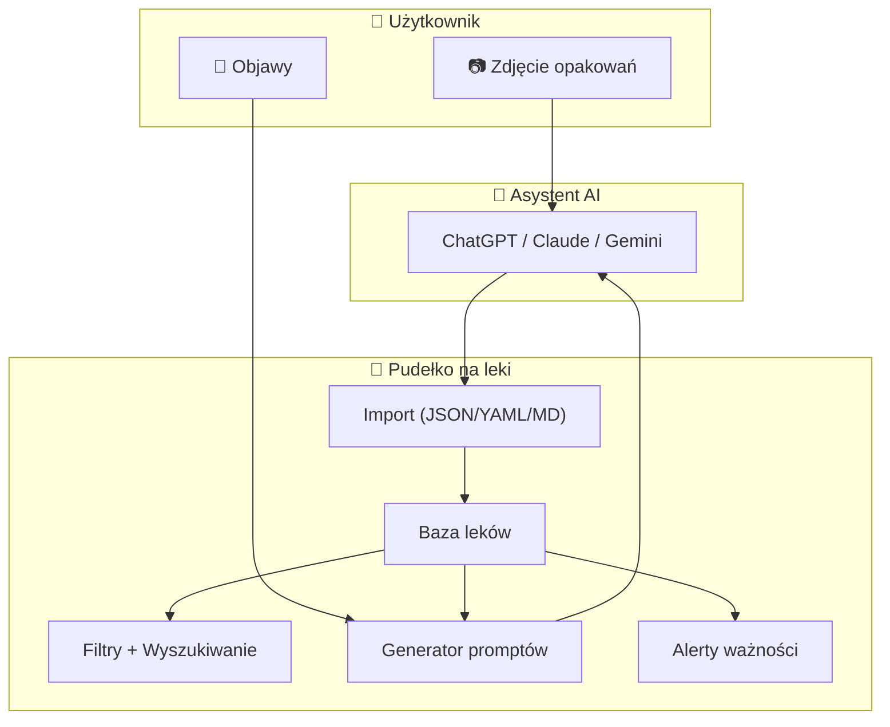

# 🏛️ Architektura

> **Powiązane:** [Roadmap](roadmap.md) | [Baza Danych](database.md) | [Bezpieczeństwo](security.md) | [Konwencje](conventions.md)

---

## 📋 Dokumentacja

| Dokument | Opis |
|----------|------|
| [Architektura](architecture.md) | Przegląd systemu, stack, warstwy (ten plik) |
| [Wdrożenie](deployment.md) | Konfiguracja WinSCP i APK cleanup |
| [Release Guide](guidelines/release.md) | Strategia wersjonowania |
| [Proces dodawania](guidelines/drug_addition_process.md) | Skaner i AI krok po kroku |
| [Baza Danych](database.md) | Encje, schema JSON/YAML |
| [Bezpieczeństwo](security.md) | Lokalne dane, disclaimer medyczny |
| [Roadmap](roadmap.md) | Plan rozwoju projektu |

---

## Przegląd Systemu



### Przepływ danych

1. **Import leków:** Użytkownik robi zdjęcie → wkleja do AI → kopiuje wynik → importuje do aplikacji
2. **Analiza objawów:** Użytkownik definiuje objawy → generator tworzy prompt z apteczką → AI analizuje → użytkownik czyta rekomendacje
3. **Filtrowanie:** Użytkownik przegląda leki po tagach, objawach, terminie ważności

---

## Stack Technologiczny

### Faza 1: MVP Web

| Warstwa | Technologia |
|---------|-------------|
| **Framework** | Next.js 16 (App Router) |
| **UI** | React + Tailwind CSS |
| **Przechowywanie** | localStorage (offline-first) |
| **Walidacja** | Zod + JSON Schema |
| **Język** | TypeScript |

### Faza 2: Backend

| Warstwa | Technologia |
|---------|-------------|
| **API** | Next.js API Routes lub Express |
| **Baza danych** | SQLite (dev) → PostgreSQL (prod) |
| **ORM** | Prisma lub Drizzle |
| **Autentykacja** | NextAuth.js (opcjonalne) |

### Faza 4: Mobile

| Warstwa | Technologia |
|---------|-------------|
| **Framework** | Flutter |
| **Język** | Dart |
| **Lokalna baza** | Hive lub Isar |
| **HTTP** | Dio |

---

## Struktura Katalogów (Monorepo)

```text
APPteczka/
├── apps/
│   ├── web/                    # Next.js 16 (Faza 1)
│   │   ├── src/
│   │   │   ├── app/            # App Router
│   │   │   ├── components/
│   │   │   └── lib/
│   │   ├── public/
│   │   └── package.json
│   │
│   └── mobile/                 # Flutter (Faza 2)
│       ├── lib/
│       ├── android/
│       ├── ios/
│       └── pubspec.yaml
│
├── packages/
│   └── shared/                 # Wspólne schematy
│       └── schemas/
│
├── docs/                       # Dokumentacja
├── package.json                # npm workspaces
└── README.md
```

---

## Model Danych

> Szczegóły: **[database.md](database.md)**

### Główna encja: Lek

```typescript
interface Medicine {
  id: string;              // UUID
  nazwa: string | null;    // Nazwa leku (null jeśli nierozpoznana)
  opis: string;            // Krótki opis działania
  wskazania: string[];     // Lista wskazań
  tagi: string[];          // Kontrolowane tagi (filtry)
  terminWaznosci?: Date;   // Opcjonalny termin ważności
  dataDodania: Date;       // Timestamp importu
}
```

---

## Integracja z AI

### Faza 1: Prompty Copy-Paste

```text
┌──────────────┐     ┌─────────────────┐     ┌──────────────┐
│  Użytkownik  │────▶│  ChatGPT/Gemini │────▶│ Pudełko na leki │
│  (zdjęcie)   │     │  (prompt z /docs│     │  (import)    │
└──────────────┘     └─────────────────┘     └──────────────┘
```

Gotowe prompty: `docs/prompts/`

### Faza 3: API Gemini

```text
┌──────────────┐     ┌──────────────┐     ┌──────────────┐
│  Użytkownik  │────▶│ Pudełko na leki │────▶│  Gemini API  │
│  (upload)    │     │  (automatyczny│     │  (Vision)    │
└──────────────┘     │   import)     │     └──────────────┘
                     └──────────────┘
```

---

## Bezpieczeństwo

> Szczegóły: **[security.md](security.md)**

| Aspekt | Rozwiązanie |
|--------|-------------|
| **Dane lokalne** | localStorage / IndexedDB (Faza 1) |
| **Bez wysyłki** | Dane nie opuszczają przeglądarki |
| **Disclaimer** | "To nie jest porada medyczna" |

---

> 📅 **Ostatnia aktualizacja:** 2026-01-14
> 🏷️ **Wersja:** 1.1.0
