# 🏛️ Architektura – Pudełko na leki

> **Powiązane:** [Road Map](road_map.md) | [Model Danych](data_model.md) | [Bezpieczeństwo](security.md)

---

## 📋 Dokumentacja

| Dokument | Opis |
|----------|------|
| [Architektura](architecture.md) | Przegląd systemu, stack, warstwy (ten plik) |
| [Model Danych](data_model.md) | Encje, schema JSON/YAML |
| [Bezpieczeństwo](security.md) | Lokalne dane, disclaimer medyczny |
| [Road Map](road_map.md) | Plan rozwoju projektu |

---

## Przegląd Systemu

```mermaid
flowchart TB
    subgraph User ["👤 Użytkownik"]
        Photo["📷 Zdjęcie opakowań"]
        Symptoms["🤒 Objawy"]
    end

    subgraph AI ["🤖 Asystent AI"]
        GPT["ChatGPT / Claude / Gemini"]
    end

    subgraph App ["📱 Pudełko na leki"]
        Import["Import (JSON/YAML/MD)"]
        DB["Baza leków"]
        Filters["Filtry + Wyszukiwanie"]
        Generator["Generator promptów"]
        Alerts["Alerty ważności"]
    end

    Photo --> GPT
    GPT --> Import
    Import --> DB
    Symptoms --> Generator
    DB --> Generator
    Generator --> GPT
    DB --> Filters
    DB --> Alerts
```



### Przepływ danych

1. **Import leków:** Użytkownik robi zdjęcie → wkleja do AI → kopiuje wynik → importuje do aplikacji
2. **Analiza objawów:** Użytkownik definiuje objawy → generator tworzy prompt z apteczką → AI analizuje → użytkownik czyta rekomendacje
3. **Filtrowanie:** Użytkownik przegląda leki po tagach, objawach, terminie ważności

---

## Stack Technologiczny

### Faza 1: MVP Web

| Warstwa | Technologia |
|---------|-------------|
| **Framework** | Next.js 14+ (App Router) |
| **UI** | React + Tailwind CSS |
| **Przechowywanie** | localStorage (offline-first) |
| **Walidacja** | Zod + JSON Schema |
| **Język** | TypeScript |

### Faza 2: Backend

| Warstwa | Technologia |
|---------|-------------|
| **API** | Next.js API Routes lub Express |
| **Baza danych** | SQLite (dev) → PostgreSQL (prod) |
| **ORM** | Prisma lub Drizzle |
| **Autentykacja** | NextAuth.js (opcjonalne) |

### Faza 4: Mobile

| Warstwa | Technologia |
|---------|-------------|
| **Framework** | Flutter |
| **Język** | Dart |
| **Lokalna baza** | Hive lub Isar |
| **HTTP** | Dio |

---

## Struktura Katalogów (Faza 1)

```text
Pudełko-na-leki/
├── docs/                     # Dokumentacja
│   ├── architecture.md
│   ├── road_map.md
│   ├── data_model.md
│   ├── security.md
│   ├── schema/               # Schematy JSON/YAML
│   ├── prompts/              # Prompty dla AI
│   └── example_input/        # Przykładowe dane
│
├── src/
│   ├── app/                  # Next.js App Router
│   │   ├── page.tsx          # Apteczka (lista leków)
│   │   ├── dodaj/page.tsx    # Dodaj leki (import AI)
│   │   ├── konsultacja/page.tsx # Konsultacja AI
│   │   ├── backup/page.tsx   # Kopia zapasowa
│   │   ├── layout.tsx        # Layout z nawigacją
│   │   └── globals.css       # Style neumorficzne
│   │
│   ├── components/
│   │   ├── Header.tsx        # Nagłówek z scroll toggle
│   │   ├── MedicineCard.tsx
│   │   ├── MedicineList.tsx
│   │   ├── Filters.tsx
│   │   ├── ImportForm.tsx
│   │   └── PromptGenerator.tsx
│   │
│   ├── lib/
│   │   ├── types.ts          # Typy TypeScript
│   │   ├── storage.ts        # localStorage helpers
│   │   ├── validation.ts     # Walidacja Zod
│   │   └── prompts.ts        # Generatory promptów
│   │
│   └── styles/
│       └── globals.css
│
├── public/
├── package.json
└── README.md
```

---

## Model Danych

> Szczegóły: **[data_model.md](data_model.md)**

### Główna encja: Lek

```typescript
interface Medicine {
  id: string;              // UUID
  nazwa: string | null;    // Nazwa leku (null jeśli nierozpoznana)
  opis: string;            // Krótki opis działania
  wskazania: string[];     // Lista wskazań
  tagi: string[];          // Kontrolowane tagi (filtry)
  terminWaznosci?: Date;   // Opcjonalny termin ważności
  dataDodania: Date;       // Timestamp importu
}
```

---

## Integracja z AI

### Faza 1: Prompty Copy-Paste

```text
┌──────────────┐     ┌─────────────────┐     ┌──────────────┐
│  Użytkownik  │────▶│  ChatGPT/Gemini │────▶│ Pudełko na leki │
│  (zdjęcie)   │     │  (prompt z /docs│     │  (import)    │
└──────────────┘     └─────────────────┘     └──────────────┘
```

Gotowe prompty: `docs/prompts/`

### Faza 3: API Gemini

```text
┌──────────────┐     ┌──────────────┐     ┌──────────────┐
│  Użytkownik  │────▶│ Pudełko na leki │────▶│  Gemini API  │
│  (upload)    │     │  (automatyczny│     │  (Vision)    │
└──────────────┘     │   import)     │     └──────────────┘
                     └──────────────┘
```

---

## Bezpieczeństwo

> Szczegóły: **[security.md](security.md)**

| Aspekt | Rozwiązanie |
|--------|-------------|
| **Dane lokalne** | localStorage / IndexedDB (Faza 1) |
| **Bez wysyłki** | Dane nie opuszczają przeglądarki |
| **Disclaimer** | "To nie jest porada medyczna" |

---

> 📅 **Ostatnia aktualizacja:** 2025-12-25
> 🏷️ **Wersja:** 1.1.0
