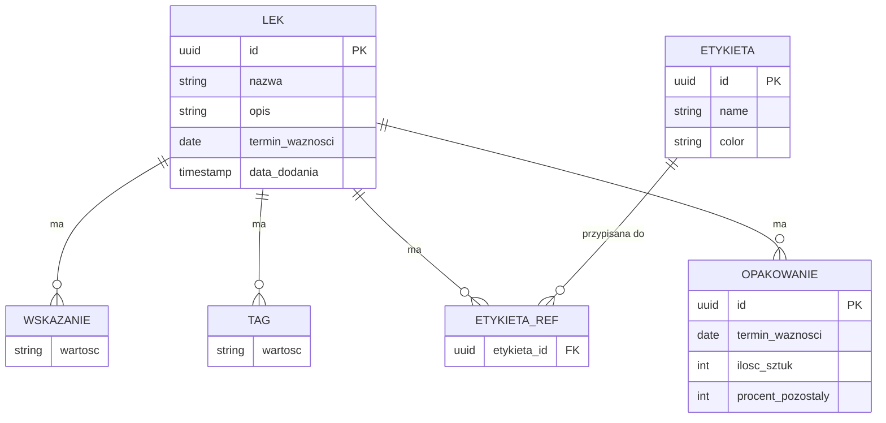

# 📊 Model Danych – Pudełko na leki

> **Powiązane:** [Architektura](architecture.md) | [Proces dodawania](drug_addition_process.md) | [Bezpieczeństwo](security.md)

---

## Diagram ERD



---

## Główna Encja: Lek

| Pole | Typ | Wymagane | Opis |
|------|-----|----------|------|
| `id` | UUID | ✅ | Unikalny identyfikator |
| `nazwa` | string \| null | ✅ | Nazwa leku (null jeśli nierozpoznana) |
| `opis` | string | ✅ | Krótki opis działania |
| `wskazania` | string[] | ✅ | Lista wskazań do stosowania |
| `tagi` | string[] | ✅ | Kontrolowane tagi (filtry) |
| `labels` | string[] | ❌ | ID etykiet użytkownika (max 5) |
| `packages` | Package[] | ✅ | Lista opakowań z datami ważności |
| `terminWaznosci` | Date | ❌ | *Computed*: najkrótsza data z opakowań |
| `dataDodania` | timestamp | ✅ | Automatyczna data importu |

---

## Encja: Etykieta (UserLabel)

| Pole | Typ | Wymagane | Opis |
|------|-----|----------|------|
| `id` | UUID | ✅ | Unikalny identyfikator |
| `name` | string | ✅ | Nazwa etykiety (max 20 znaków) |
| `color` | LabelColor | ✅ | Kolor: red, orange, yellow, green, blue, purple, pink, gray |

**Limity:** max 15 etykiet globalnie, max 5 etykiet na lek

---

## TypeScript Interfaces

```typescript
interface Medicine {
  id: string;
  nazwa: string | null;
  opis: string;
  wskazania: string[];
  tagi: string[];
  labels?: string[];        // ID etykiet użytkownika
  packages: MedicinePackage[];
  terminWaznosci?: Date;    // Computed property (najkrótsza data)
  dataDodania: Date;
}

interface MedicinePackage {
  id: string;
  expiryDate: string;      // ISO8601 YYYY-MM-DD
  pieceCount?: number;     // Opcjonalna ilość sztuk
  percentRemaining?: number; // Opcjonalny % pozostały
}

interface UserLabel {
  id: string;
  name: string;
  color: LabelColor;
}

type LabelColor = 'red' | 'orange' | 'yellow' | 'green' | 'blue' | 'purple' | 'pink' | 'gray';
```

---

## Kontrolowane Tagi

> Zaktualizowano: 2026-01-05

### Objawy i działanie (połączone)

`ból` | `ból głowy` | `ból gardła` | `ból mięśni` | `ból menstruacyjny` | `ból ucha` | `przeciwbólowy` | `nudności` | `wymioty` | `biegunka` | `zaparcia` | `wzdęcia` | `zgaga` | `kolka` | `przeciwwymiotny` | `przeciwbiegunkowy` | `przeczyszczający` | `gorączka` | `kaszel` | `katar` | `duszność` | `przeciwgorączkowy` | `przeciwkaszlowy` | `wykrztuśny` | `świąd` | `wysypka` | `oparzenie` | `ukąszenie` | `rana` | `sucha skóra` | `suche oczy` | `alergia` | `przeciwhistaminowy` | `przeciwświądowy` | `nawilżający` | `bezsenność` | `stres` | `choroba lokomocyjna` | `afty` | `ząbkowanie` | `przeciwzapalny` | `odkażający` | `uspokajający` | `rozkurczowy` | `probiotyk` | `antybiotyk` | `steryd`

### Typ infekcji

`infekcja wirusowa` | `infekcja bakteryjna` | `infekcja grzybicza` | `przeziębienie` | `grypa`

### Rodzaj leku

`bez recepty` | `na receptę` | `suplement` | `wyrób medyczny`

> **Uwaga:** Stare tagi `lek OTC` i `lek Rx` są automatycznie zamieniane na `bez recepty` i `na receptę`.

### Grupa docelowa

`dla dorosłych` | `dla dzieci` | `dla niemowląt` | `dla kobiet w ciąży`

---

## Schematy Walidacji

| Format | Plik |
|--------|------|
| JSON Schema | [apteczka_import.schema.json](schema/apteczka_import.schema.json) |
| YAML Schema | [apteczka_import.schema.yaml](schema/apteczka_import.schema.yaml) |
| JSON Schema (z enum) | [apteczka_import_enum.schema.json](schema/apteczka_import_enum.schema.json) |

---

## Przechowywanie Danych

| Faza | Metoda | Opis |
|------|--------|------|
| 1 | localStorage | Prosty JSON w przeglądarce |
| 2 | IndexedDB | Większa pojemność, offline-first |
| 2+ | SQLite/PostgreSQL | Backend z synchronizacją |
| 4 | Hive/Isar (Flutter) | Lokalna baza mobilna |

---

> 📅 **Ostatnia aktualizacja:** 2025-12-24
