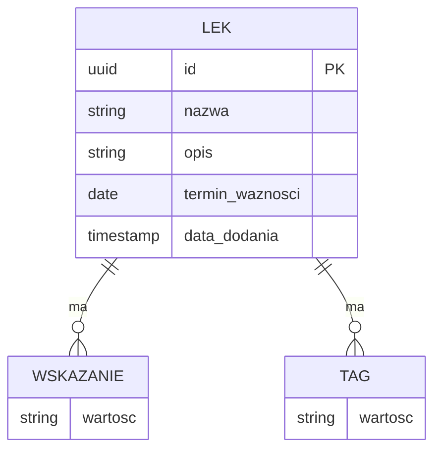

# 📊 Model Danych – APPteczka

> **Powiązane:** [Architektura](architecture.md) | [Bezpieczeństwo](security.md)

---

## Diagram ERD



---

## Główna Encja: Lek

| Pole | Typ | Wymagane | Opis |
|------|-----|----------|------|
| `id` | UUID | ✅ | Unikalny identyfikator |
| `nazwa` | string \| null | ✅ | Nazwa leku (null jeśli nierozpoznana) |
| `opis` | string | ✅ | Krótki opis działania |
| `wskazania` | string[] | ✅ | Lista wskazań do stosowania |
| `tagi` | string[] | ✅ | Kontrolowane tagi (filtry) |
| `terminWaznosci` | Date | ❌ | Opcjonalny termin ważności |
| `dataDodania` | timestamp | ✅ | Automatyczna data importu |

---

## TypeScript Interface

```typescript
interface Medicine {
  id: string;
  nazwa: string | null;
  opis: string;
  wskazania: string[];
  tagi: string[];
  terminWaznosci?: Date;
  dataDodania: Date;
}
```

---

## Kontrolowane Tagi

> Źródło: [Kontrolowana lista tagów](example_input/Kontrolowana%20lista%20tagów.md)

### Objawy

`ból` | `gorączka` | `kaszel` | `katar` | `ból gardła` | `ból głowy` | `ból mięśni` | `biegunka` | `nudności` | `wymioty` | `alergia` | `zgaga`

### Typ infekcji

`infekcja wirusowa` | `infekcja bakteryjna` | `przeziębienie` | `grypa`

### Działanie leku

`przeciwbólowy` | `przeciwgorączkowy` | `przeciwzapalny` | `przeciwhistaminowy` | `przeciwkaszlowy` | `wykrztuśny` | `przeciwwymiotny` | `przeciwbiegunkowy`

### Grupa użytkowników

`dla dorosłych` | `dla dzieci`

---

## Schematy Walidacji

| Format | Plik |
|--------|------|
| JSON Schema | [apteczka_import.schema.json](schema/apteczka_import.schema.json) |
| YAML Schema | [apteczka_import.schema.yaml](schema/apteczka_import.schema.yaml) |
| JSON Schema (z enum) | [apteczka_import_enum.schema.json](schema/apteczka_import_enum.schema.json) |

---

## Przechowywanie Danych

| Faza | Metoda | Opis |
|------|--------|------|
| 1 | localStorage | Prosty JSON w przeglądarce |
| 2 | IndexedDB | Większa pojemność, offline-first |
| 2+ | SQLite/PostgreSQL | Backend z synchronizacją |
| 4 | Hive/Isar (Flutter) | Lokalna baza mobilna |

---

> 📅 **Ostatnia aktualizacja:** 2025-12-22
