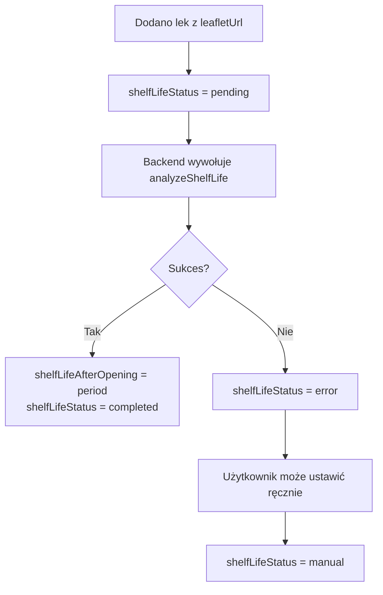

# Prompt Gemini Shelf Life – Analiza Ulotki PDF

> **Endpoint:** `/api/gemini-shelf-life`  
> **Funkcja:** `generateShelfLifePrompt()`  
> **Model:** `gemini-3-flash-preview`  
> **Plik źródłowy:**
> [prompts.ts](file:///c:/Users/rzemp/GitHub/APPteczka/apps/web/src/lib/prompts.ts#L225-L286)  
> **Wersja:** v0.004

---

## ✅ Status Implementacji

> [!NOTE] **Prompt Shelf Life nie wymagał rozszerzeń w v0.004.** Jego zakres jest wąski i dobrze
> zdefiniowany – ekstrakcja terminu ważności po otwarciu z ulotki PDF.

| Aspekt                         | Status       | Uwagi                               |
| ------------------------------ | ------------ | ----------------------------------- |
| Ekstrakcja terminu po otwarciu | ✅ Kompletne | Działa zgodnie z przeznaczeniem     |
| Dosłowny cytat z ulotki        | ✅ Kompletne | Zapobiega halucynacjom              |
| Normalizacja `period`          | ✅ Kompletne | Format naturalny (np. "6 miesięcy") |

---

## Aktualny Prompt (v0.004)

````markdown
# Prompt – Analiza terminu ważności produktu po pierwszym otwarciu

## Rola

Jesteś asystentem farmacji analizującym ulotki leków.

## Wejście

Ulotka leku w formacie PDF.

## Zadanie

1. Przeszukaj ulotkę w poszukiwaniu informacji o **terminie ważności produktu po pierwszym
   otwarciu**.
2. Informacja ta zazwyczaj znajduje się w sekcjach:
   - "Termin ważności"
   - "Przechowywanie"
   - "Warunki przechowywania"
   - "Okres ważności po pierwszym otwarciu"
3. Szukaj fraz takich jak:
   - "Po otwarciu zużyć w ciągu [okres]"
   - "Okres ważności po otwarciu: [okres]"
   - "Po pierwszym otwarciu należy zużyć w ciągu [okres]"
   - "Termin przydatności po otwarciu opakowania: [okres]"

## Format wyjścia (OBOWIĄZKOWY JSON)

### Gdy znaleziono informację:

```json
{
	"status": "znaleziono",
	"shelfLife": "dosłowny cytat z ulotki",
	"period": "6 miesięcy"
}
```
````

### Gdy nie znaleziono:

```json
{
	"status": "nie_znaleziono",
	"reason": "W ulotce nie znaleziono informacji o terminie ważności po pierwszym otwarciu."
}
```

````

---

## Analiza Skuteczności

### ✅ Mocne strony

| Aspekt | Ocena | Komentarz |
|--------|-------|-----------|
| Jasność zadania | ⭐⭐⭐⭐⭐ | Jednoznaczne – znajdź termin po otwarciu |
| Wymuszenie cytatu | ⭐⭐⭐⭐⭐ | "DOSŁOWNY CYTAT" zapobiega halucynacjom |
| Lista fraz do szukania | ⭐⭐⭐⭐ | Pomaga modelowi zlokalizować informację |
| Normalizacja okresu | ⭐⭐⭐⭐ | `period` w formacie naturalnym ułatwia przetwarzanie |

### Porównanie z danymi RPL

| Aspekt | Gemini Shelf Life | RPL / ChPL | Wynik |
|--------|-------------------|-----------|-------|
| Termin po otwarciu | ✅ Ekstrahuje z PDF | ❌ Nie ma w API | **Gemini jedyna opcja** |
| Warunki przechowywania | ❌ Nie ekstrahuje | ❌ Nie ma w API | **Potencjalne rozszerzenie** |
| Dokładność | ⭐⭐⭐⭐ Cytat z źródła | N/A | **Wysoka wiarygodność** |
| Automatyzacja | ✅ Pełna | N/A | **Kluczowa wartość** |

---

## Wyroby Medyczne – Ograniczenia

> [!CAUTION]
> **Wyroby medyczne zazwyczaj nie mają ulotek PDF w formacie farmaceutycznym.** Ten prompt jest dedykowany lekom z ChPL (Charakterystyka Produktu Leczniczego).

**Problemy dla wyrobów medycznych:**
1. Wyroby medyczne mają instrukcje obsługi, nie ulotki
2. Format dokumentacji różni się od farmaceutycznego
3. Termin "po otwarciu" może nie mieć zastosowania (np. termometr)

**Rekomendacja:** Routing na poziomie aplikacji – wywoływać ten prompt tylko dla `productType: "lek"`.

---

## Integracja z Modelem Medicine

Pole `shelfLifeAfterOpening` w modelu `Medicine` przechowuje wynik:

```dart
class Medicine {
  final String? shelfLifeAfterOpening;  // Cytat z ulotki
  final String? shelfLifeStatus;        // "pending" | "completed" | "error" | "manual"
  // ...
}
````

**Flow:**



---

## Potencjalne Rozszerzenia

### 1. Dodanie ekstrakcji warunków przechowywania

```diff
{
  "status": "znaleziono",
  "shelfLife": "dosłowny cytat z ulotki",
  "period": "6 miesięcy",
+ "storage": "Przechowywać w temperaturze poniżej 25°C. Chronić przed światłem."
}
```

**Uzasadnienie:** Warunki przechowywania są często obok terminu ważności i są wartościowe dla
użytkownika.

### 2. Normalizacja `period` do dni

```diff
{
  "status": "znaleziono",
  "shelfLife": "dosłowny cytat z ulotki",
  "period": "6 miesięcy",
+ "periodDays": 180
}
```

**Uzasadnienie:** Ułatwia obliczenie daty "Zużyć przed" w aplikacji bez parsowania stringa.

### 3. Obsługa wielu terminów

```diff
{
  "status": "znaleziono",
+ "variants": [
+   { "condition": "po otwarciu butelki", "period": "30 dni" },
+   { "condition": "po otwarciu saszetki", "period": "24 godziny" }
+ ]
}
```

**Uzasadnienie:** Niektóre leki (np. syropy, krople) mają różne terminy dla różnych opakowań.

---

## Scenariusze Testowe

| Scenariusz                                      | Oczekiwany wynik                                          |
| ----------------------------------------------- | --------------------------------------------------------- |
| PDF z jasnym "Po otwarciu zużyć w ciągu 28 dni" | `{ status: "znaleziono", period: "28 dni" }`              |
| PDF bez informacji o terminie po otwarciu       | `{ status: "nie_znaleziono" }`                            |
| PDF z wieloma terminami (butelka vs saszetka)   | Pierwszy/najbardziej ogólny                               |
| PDF uszkodzony / nieczytelny                    | `{ status: "nie_znaleziono" }` + error handling           |
| Ulotka wyrobu medycznego                        | Prawdopodobnie `nie_znaleziono` (brak standardowej frazy) |

---

## Podsumowanie

| Metryka                                | Wartość                                   |
| -------------------------------------- | ----------------------------------------- |
| **Skuteczność dla leków z ulotką PDF** | 🟢 Wysoka                                 |
| **Skuteczność dla wyrobów medycznych** | 🔴 Niska (nie dotyczy)                    |
| **Wiarygodność danych**                | 🟢 Wysoka (cytat z źródła)                |
| **Kompletność**                        | 🟡 Średnia (brak warunków przechowywania) |

> [!TIP] **Ten prompt działa dobrze dla swojego wąskiego celu.** Rozważ w przyszłości dodanie pola
> `storage` (warunki przechowywania) i `periodDays` (normalizacja do dni) dla lepszej integracji z
> aplikacją.

---

_Ostatnia aktualizacja: 2026-01-25 (review v0.004)_
